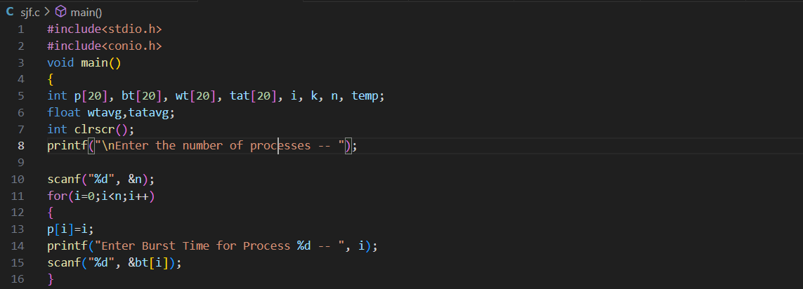
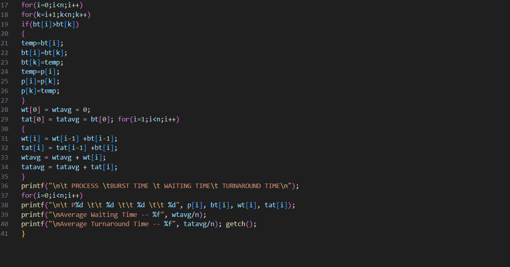
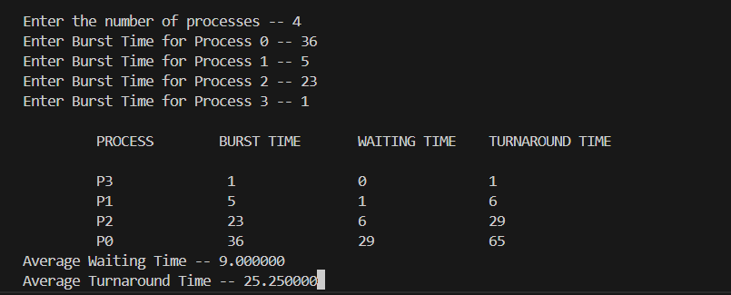
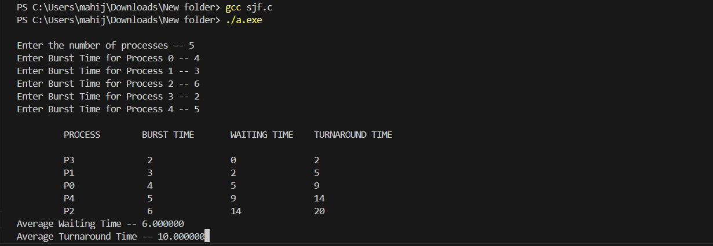

# Operating-Systems-and-Computer-Networks-Lab
Laboratory Program

#FCFS program status

##program files of fcfs

##sample input and output of fcfs

##tested input and output of fcfs

#SJF program status

##program file of sjf

##sample input and output of sjf

##tested input and output of sjf

