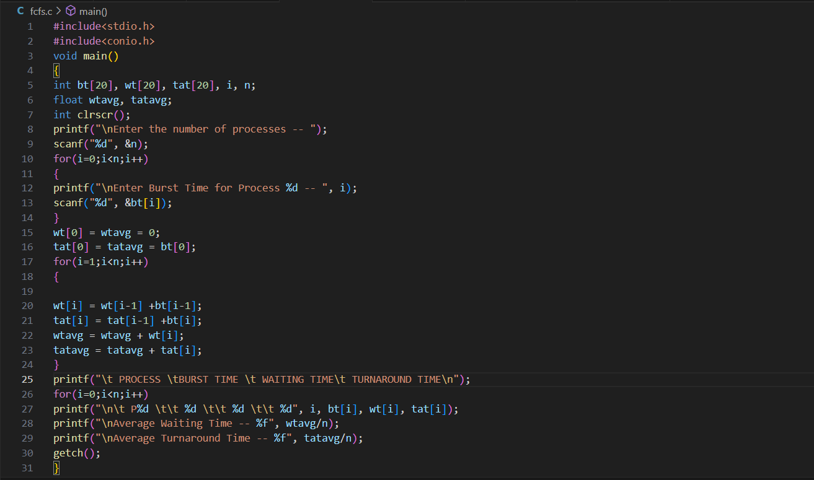
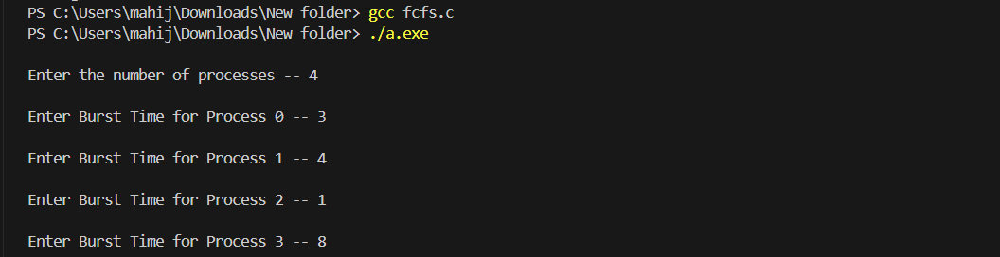
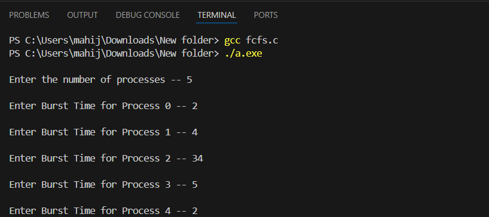
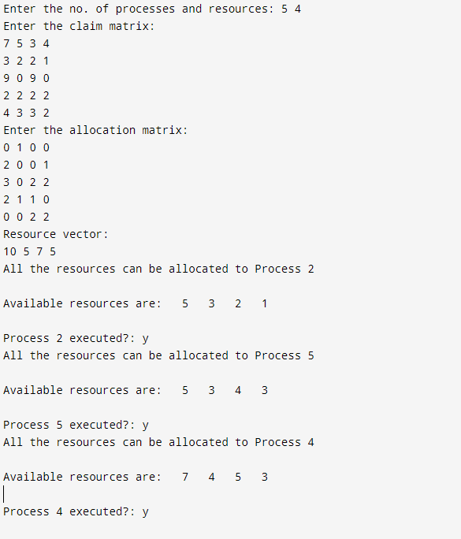

# Operating-Systems-and-Computer-Networks-Lab
Laboratory Program

#FCFS program status

##program files of fcfs

##sample input and output of fcfs

##tested input and output of fcfs

#SJF program status

##program file of sjf

##sample input and output of sjf

##tested input and output of sjf

#RoundRobin program status

##program files of RoundRobin 

##sample input and output of RoundRobin

##tested output and output of RoundRobin

#Priority program status

##program files of priority

##sample input and output of priority

##tested input and output of priority

#FIFO program status

##program files of fifo

##sample input and output of fifo

##executed input and output of fifo

#LRU program status

##program files of lru

##sample input and output of lru

##executed input and output of lru

#OPTIMAL PAGE REPLACEMENT program status

##program files of optimal page replacement

##sample input and output of optimal

##executed input and output of optimal

#DEADLOCK AVOIDANCE program status

##program files of deadlock avoidance

##sample input and output of deadlock avoidance

##executed input and output of avoidance

#DEADLOCK PREVENTION program status

##program files of deadlock prevention

##sample input and output of deadlock prevention

##executed input and output of prevention

