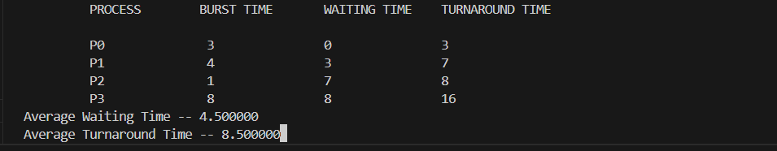

# Operating-Systems-and-Computer-Networks-Lab
Laboratory Program

#FCFS program status

##program files of fcfs

##sample input and output of fcfs

##tested input and output of fcfs

#SJF program status

##program file of sjf

##sample input and output of sjf

##tested input and output of sjf

#RoundRobin program status

##program files of RoundRobin 

##sample input and output of RoundRobin

##tested output and output of RoundRobin

#Priority program status

##program files of priority

##sample input and output of priority

##tested input and output of priority

